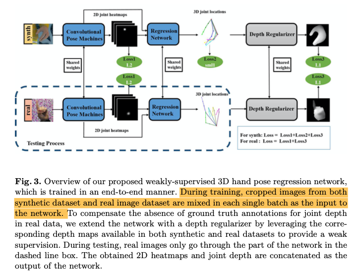

#  2020/8/1 周报
  
这周主要利用pytorch的官方资料，[《Deep learning with pytorch》](https://pytorch.org/deep-learning-with-pytorch )系统学习pytorch，全书主要分为3个part、15个chapter，从实践的角度系统的阐述了pytorch的核心思想，底层逻辑，与之前看的《Neural Networks and Deep Learning》正好相互补充，不仅理论部分有印证和加强，同时更加注重pytorch的上手实践。
  
进度上，看完了半本，目前进行到part 1 core pytorch 的最后一个chapter的 Adding memory capacity: Width部分，也在服务器上边看边写书中的一些代码，自己做一些小探究增加对pytorch基础设施的理解。

剩余的部分：part 2是在上手一个项目：LEARNING FROM IMAGES IN THE REAL WORLD: EARLY DETECTION OF LUNG CANCER，数据量有200个GB左右，同时应该会介绍一下更加进阶的数据处理和深度学习网络知识；part 3 是在介绍一些用于工业生产的模型，在部署时用到的技术，目前不太会用到，估计粗略浏览即可。目前的想法是下周基本结束这本书，同时cs231n或者其他相关的计算机视觉的课开一个，如果还有剩余的时间再把之前早就下好的Alexnet的文章捋一下，实现可能要放到下下周。
  