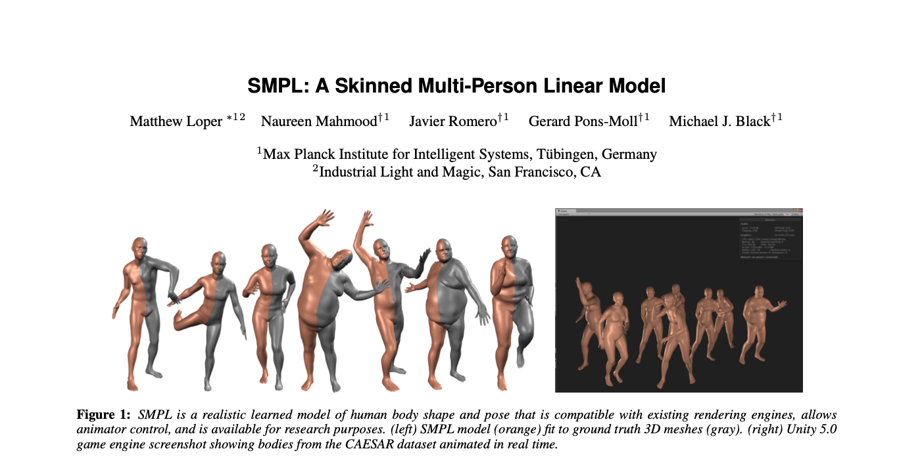

## 《SMPL: A Skinned Multi-Person Linear Model》

这是一篇2015年在ACM Transitions on Graphics上的一篇paper，提出了一种考虑姿态和个体差异对body shape产生影响的方法，文章的亮点和值得注意的地方有：
* 与同类型的模型相比，更加简单，计算复杂度低，同时与现有的render引擎兼容。
* 模型设计巧妙，采用最简单的blend skinning方法：Liner Blend Skinning（LBS），通过增加两个blend shapes，充分考虑了 shape 和 pose 对于最终 body shape 的影响，使最终的模型效果更自然，弥补了LBS方法的内在缺陷。
* Shape blend shape 和 Pose blend shape都是线性模型，并且所涉及的参数只有两个matrix：S 和 P ，很直观。
* joint location（in rest pose）在LBS模型中的作用不可忽视，直接影响了最终的模型效果，文章提出的 joint regressor 考虑了 shape dependency ，同时最终通过 LBS 得到的的 joint center（in specific poses）不仅是shape-dependent 也是 pose-dependent。
* 模型的输入参数只有两个: $\theta$, $\beta$：pose parameter和 shape parameter；要学习的内参有 T_bar W S J P：base template、 blend weights（LBS）、shape matrix、joint regressor、pose matrix。在训练上，文章使用 multi-pose 和 multi-shape 两个数据集分别对 pose parameter 和 shape parameter 分别进行训练，训练过程并不复杂，也很合理。
*  pose parameter training 过程中，loss 函数上设计了 data term 用来减少模型 output vertices 和 registration vertices 的距离，以及一些 regularization term 包括 shape joint symmetry、initial joints consistency、initial blend weights consistency、overfitting prevention项。值得一提的是joint regresoor并不是在训练过程中直接得到的，而是利用训练获得的 template mesh 和 joint location 单独训练得到。至此，模型中的 W J P 通过训练得到。
* shape parameter training 过程中，经过了一个重要的步骤，pose normalization， 从而保证了 pose 和 shape 分开被模型所学习，具体是：采用在 pose parameter 训练过程中得到的 mean shape 和 mean joint location， 通过最小化模型和 registration 中 edge 的 squared difference，得到 pose 参数 $\theta$ 的估计。再利用得到的 pose 参数，最小化模型输出的 shape 和 registration 的差异得到 subject-specific shapes。利用这些 shapes，可以得到 template shape 和 PCA 变化得到的 PC shapes 组成的 S matrix。至此模型中的 T_bar、 S 通过训练得到。
* pose parameter training 中的 pose parameter initialization 和 shape parameter training 中的 pose normalization 都需要对 pose 参数做估计， 做估计的方法都是最小化模型和 registration 中 edge 的 squared difference。
* 模型表现上，SMPL-LBS 比 SMPL-DQBS 效果更好，文章指出可能的原因是 LBS 方法的 simplicity 可能更有助于 generalization。 与基于 triangle deformation 表达 body variation、 pose-dependent deformation 等变形的 BlendSCAPE 方法的比较上，虽然两种方式的精度差异很小，但SMPL整体都要更好一些，同时也更加简单，所需要的计算量更小。
* 文章探究了在 pose blend shape 中 引入类似 blend weights 中的 sparsity，这样做的理由很直观：关节运动对远距离的 shape vertices 影响很小甚至没有，虽然 SMPL-LBS-Sparse 的效果比 SMPL 的效果要差，但是也有实用价值， 同时也侧面说明 SMPL-LBS 模型没有过拟合。
* 在模拟 dynamic soft-issue deformation 方面，文章提出了 DMPL 方法：增加一个 dynamic blend shapes， dynamic blend shape function 将 dynamic control vector 和 shape coefficients 作为input，同时延续了之前线性的风格。与 shape blend shape 类似，利用了 PCA 变化得到 dynamic blend shape matrix D，不同的是引入了一个函数 f 用来估计 D 的 coefficients。
* 在 dicussion 部分，文章指出：好的训练数据和模型的简单性，让多参数在大数据集上同时训练成为可能；vertex-based models 相比于 triangle-deformation-based models 直接减小模型输出和训练数据之间的均方误差，可能是让它效果更好的原因； SMPL模型能够成功的一个关键点是没有直接使用 pose parameter（joint axis-angle representation） 作为 pose blend shape funtion 的线性系数，而是使用了 rotation matrix 组成的 vector 作为线性系数。

文章可能存在的不足：
* 在dicussion部分，文章指出可能存在其他好的 features 用来 drive pose blend shapes。
* 现有的 pose-dependent offsets 并没有考虑 shape 的差异，例如小孩和成年人，同一个 pose 由于体型不同， offset 直观上也会存在差异，可以考虑像 DMPL 中 将shape coefficients 考虑进来估计pose blend shape coefficients。